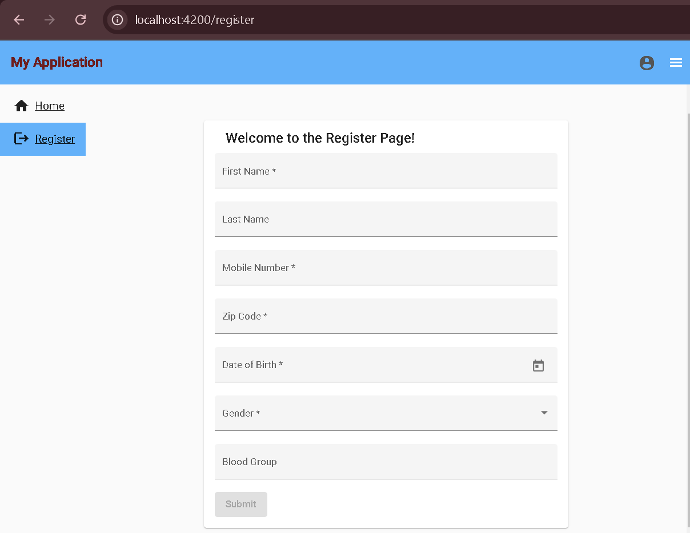
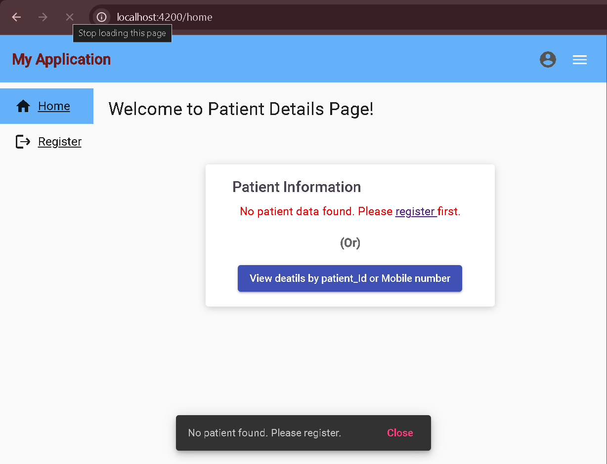
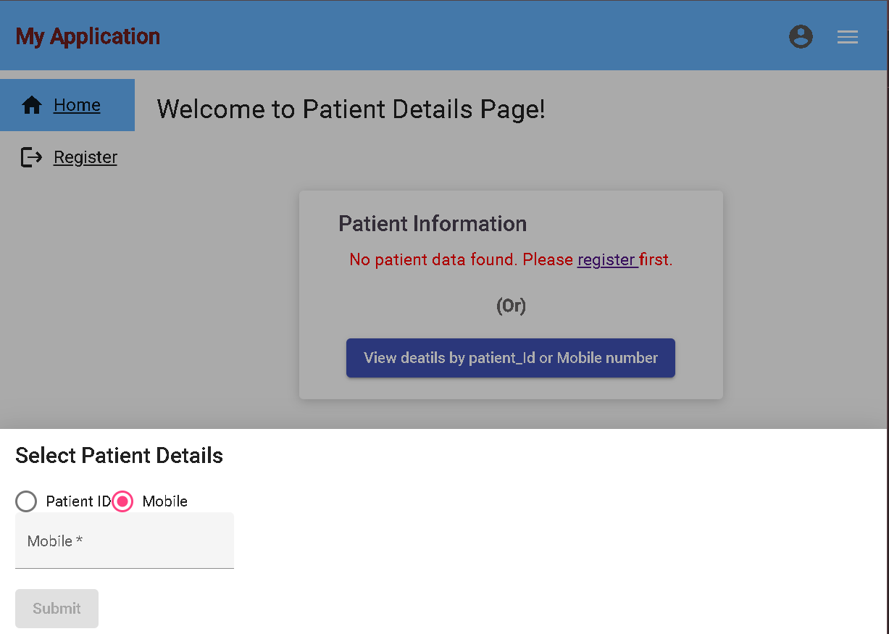
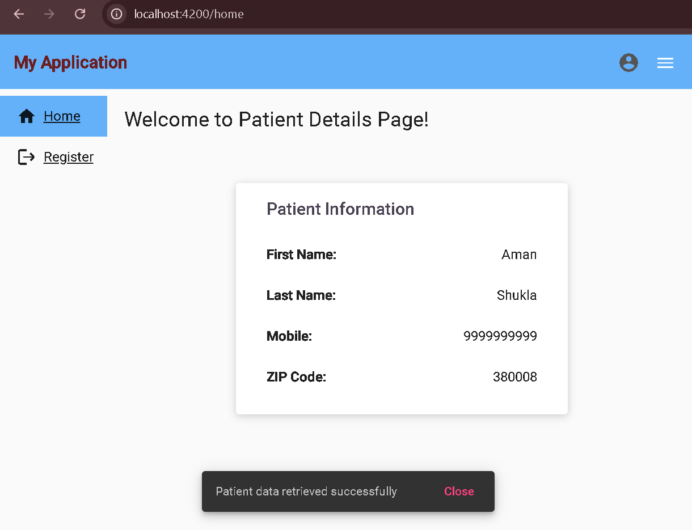

# Patient Fullfillment Api Integration

## Overview

The Patient Fullfillment Api Integration project is an Angular-based web application designed to manage and view patient information efficiently. Users can retrieve patient details using either a Patient ID or a mobile number. The application also provides a user-friendly interface with Angular Material components for better user experience.

## Features

- **Patient Lookup**: Search for patient details using Patient ID or Mobile number.
- **Form Validation**: Input fields are validated for proper formatting and required information.
- **User Feedback**: Notifications are provided for successful actions or errors using MatSnackBar.
- **Bottom Sheet Dialogs**: A responsive interface allows users to enter their details in a bottom sheet dialog.
- **Session Management**: Patient information is stored in session storage for seamless retrieval.

## Technologies Used

- Angular
- Angular Material
- RxJS
- TypeScript
- HTML/CSS

### Snapshots:

Registration Form Screenshot:

Patient Detail View Page:

Patient View Form Detail Bottom sheet:

Patient Detail Data Display:

